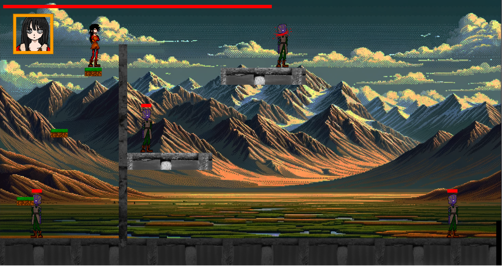

# Platformer-Browsergame

This project was created during the Creative Code Lab at UAS St. Pölten. Within 14 days, I had to develop a functional browser game using Html, CSS and JavaScript.
The Code, Artworks and Sprites where all created by me. In-Game backgrounds were generated by DALL-E

## Sprites

## Class hierarchy

## In-Game screenshot

